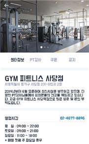

# graduation-project

> 국내 피트니스 센터 기능 통합을 위한 온라인 플랫폼
> 
> 고객들이 여러 피트니스 센터를 공유해서 사용할 수 있고 센터 측에서는 체계적인 서비스를 제공할 수 있는, 고객과 센터 모두 사용할 수 있는 온라인 헬스 케어링 공유 플랫폼을 개발

## 제안 배경 및 필요성

1. 국내 피트니스 센터간 연계 기능 미흡
2. 주저 공간 및 작업공간의 확대와 다변화에 따른 여러 피트니스 센터에서의 회원 등록 경험 다수 존재
3. 회원 맞춤형 체계적인 PT 서비스 부족

## 앱 화면 구성

### 시작 및 로그인 화면

|시작 화면|로그인 화면|
|-|-|
|||

편의를 위하여 자동 로그인 기능이 제공됨

### Application 소개 화면

||||
|-|-|-|
||||

로그인 후 서비스에 대한 간략한 소개를 제공하는 화면

### main 화면

총 5가지 네비게이션 바 존재

1. 헬스케어링
2. 건강관리
3. 검색
4. 채팅
5. 마이페이지

하단은 main 화면의 activity 중 일부를 나타냄

|헬스케어링|건강관리|마이페이지|
|-|-|-|
||||

* 헬스케어링 화면에서 주변의 피트니스 센터 목록 확인 가능
* 건강관리 화면에서 추천식단, 추천운동, PT과제 등 사용자 맞춤형 건강 관리 정보를 제공받을 수 있음
* 마이페이지에서 프로필 및 스케줄 관리, 건강 데이터 관리 등 개인정보와 관련된 사항을 확인하고 등록 및 수정하는 것이 가능

### 부가 화면
센터 선택 페이지 및 센터 정보 페이지

|센터 선택|센터 정보|
|-|-|
|||